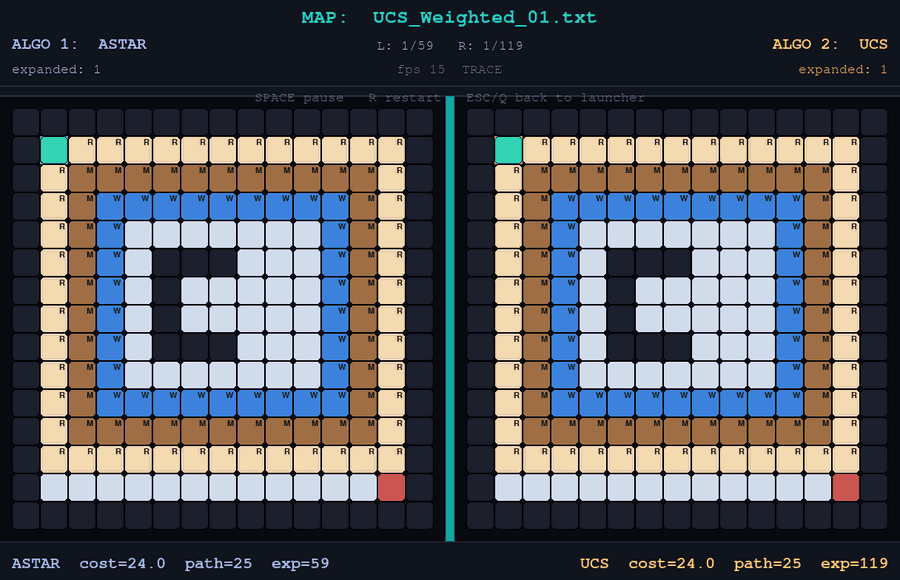

# GridWorld Search Visualizer

Run two classic search algorithms side by side on the same grid map and watch them think: every node
expansion is replayed live, then the final paths are drawn over it and a comparison chart is saved.

<p align="center">
  
</p>
<p align="center"><sub>A* vs UCS on <code>UCS_Weighted_01</code>: the same optimal path, half the expansions.</sub></p>

## Algorithms

| | Algorithm | Optimal? | Notes |
|---|---|---|---|
| Uninformed | **BFS** | in steps only | Ignores terrain cost |
| | **DFS** | no | Low memory, wanders |
| | **DLS** | no | DFS with a depth cap; shows "too shallow fails, deeper succeeds" |
| Cost-aware | **UCS** (Dijkstra) | yes | Needs non-negative step costs |
| Heuristic | **A\*** | yes | Manhattan distance, admissible while the cheapest step costs 1 |
| Meet in the middle | **BDS** | in steps only | Bidirectional BFS from start and goal |

Every run returns a `SearchResult` with `found`, `path`, `cost`, `expanded` (a time proxy) and
`frontier_max` (a memory proxy).

## Results

All six algorithms on the weighted map in the GIF. The cost is the true terrain cost of the returned
path, recomputed from the map.

| Algorithm | Path cost | Path length | Nodes expanded | Max frontier |
|---|---:|---:|---:|---:|
| **A\*** | **24** | 25 | **59** | 41 |
| UCS | 24 | 25 | 119 | 27 |
| BFS | 24 | 25 | 161 | 14 |
| BDS | 68 | 25 | 135 | 23 |
| DFS | 263 | 79 | 79 | 61 |
| DLS | 263 | 79 | 79 | 61 |

What shows up across the ten maps:

- **A\* only pulls ahead when terrain varies.** On the open, uniform-cost maps it expands exactly as many nodes as BFS (153 vs 153 on `A-Star.txt`). Every cell in the start–goal rectangle ties on `f = g + h`, and ties break toward the *lower* `g`, so it sweeps layer by layer like BFS. Breaking ties toward the higher `g` would fix that.
- **BFS and BDS find the shortest path, not the cheapest.** On the weighted map, BDS returns a 25-step path through mud that costs 68.
- **DLS can cost far more than DFS.** On `UCS.txt` it expands 433 nodes to DFS's 120, because it re-expands a state every time it reaches it at a shallower depth.

## Run it

```bash
pip install -r requirements.txt   # pygame, matplotlib
python main.py                    # interactive launcher
```

Launcher controls:

| Key | Action |
|---|---|
| ← / → | Previous / next map |
| A / D | Algorithm 1 (left grid) |
| J / L | Algorithm 2 (right grid) |
| ↑ / ↓ | Animation speed (5–120 fps) |
| Enter | Run both, side by side |

In the viewer, Space pauses, R restarts, and Esc or Q returns to the launcher. When a run finishes,
a comparison chart (bar charts plus a metrics table) is saved to `analysis/`.

Single run: prints the metrics and an ASCII path, replays the search in a window, then saves a PNG to
`results/figures/`:

```bash
python main.py --mode single --map UCS_Weighted_01.txt --algo astar
```

## Maps

Plain-text grids in `assets/maps/`. All rows must be the same width.

| Tile | Meaning | Step cost |
|---|---|---:|
| `S` / `G` | Start / goal | 1 |
| `F` | Free floor | 1 |
| `R` | Road | 1 |
| `M` | Mud | 5 |
| `W` | Water | 10 |
| `O` | Wall | blocked |

```txt
OOOOOOOOOOOO
OSFFFFFOFFFO
OFFOOOFFFGOO
OOOOOOOOOOOO
```

If a hand-edited map has ragged rows, `python Tools/Fix_Maps.py` pads or truncates them to the
most common width. It rewrites the files in place.

## Structure

```text
algos/search/       BFS, DFS, DLS, UCS, A*, BDS behind one interface
env/gridworld.py    map parsing, terrain costs, 4-way moves, Manhattan heuristic
visualization/      pygame launcher and dual viewer, matplotlib exports
utils/registry.py   name → algorithm wiring; add one here and it appears in the UI
assets/maps/        the ten maps
analysis/           comparison charts saved after each dual run
Tools/              map generator and fixer
main.py             entry point
```

## Stack

Python 3.10+ · pygame · matplotlib
